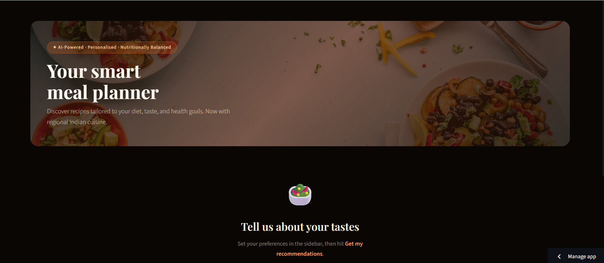
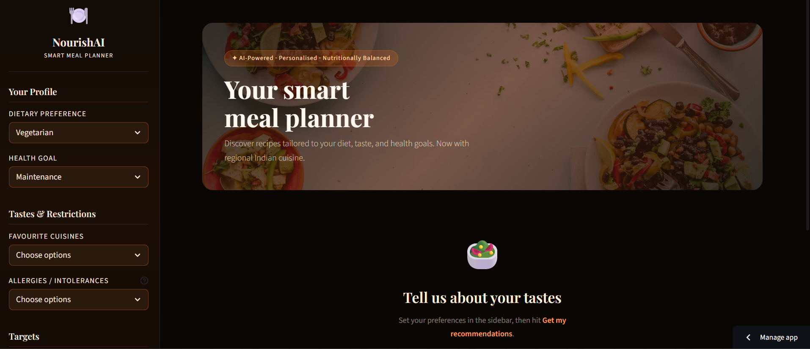
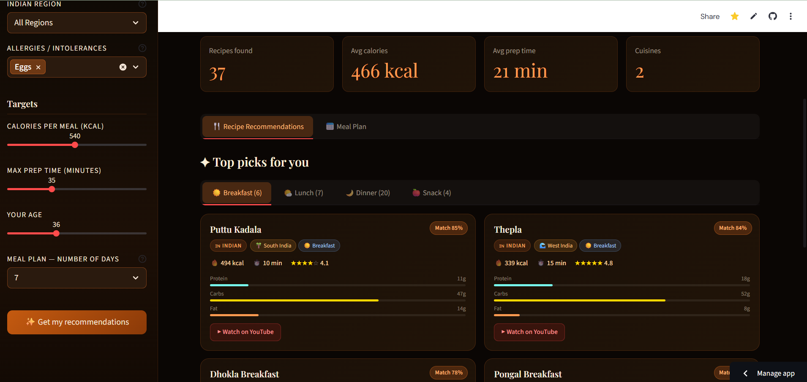
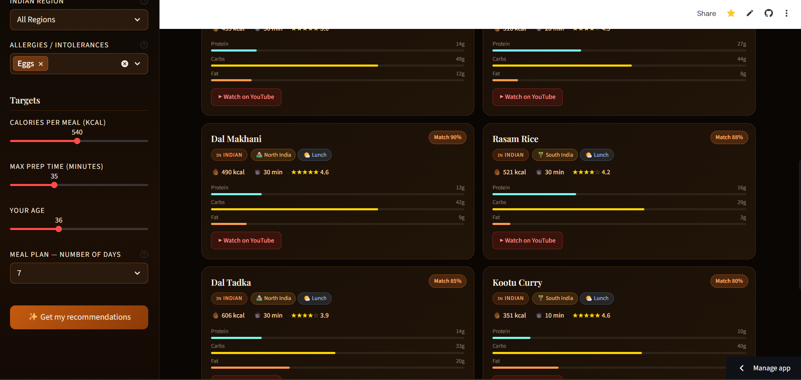
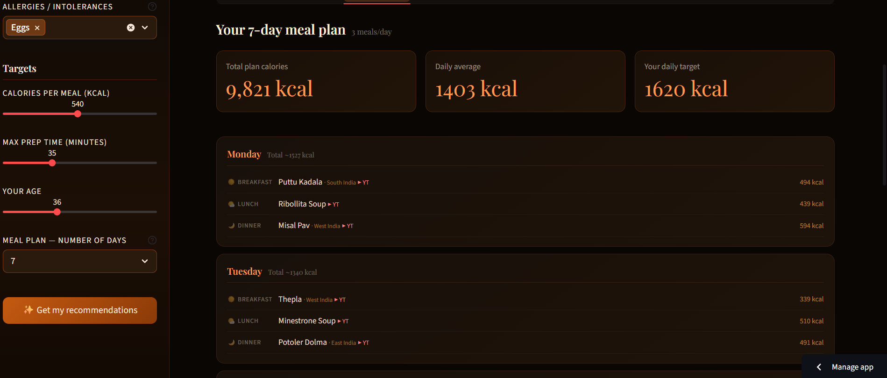

# 🍽️ NourishAI — Smart Recipe & Meal Plan Recommender

[](https://meal-planner-7.streamlit.app/)


> AI-powered, personalised meal planning app that recommends recipes based on your **diet, health goals, allergens, calorie targets, and taste preferences** — with a full 7-day meal plan and YouTube links for every recipe. Built as part of the **AI & ML Program at IIT Guwahati – IOT Academy**.

---

## 🔗 Live Demo

👉 **[Try the App Here](https://meal-planner-7.streamlit.app/)**

---

## 📌 Table of Contents

- [Overview](#overview)
- [App Features](#app-features)
- [ML Architecture](#ml-architecture)
- [App Sections](#app-sections)
- [Tech Stack](#tech-stack)
- [Project Structure](#project-structure)
- [How to Run Locally](#how-to-run-locally)
- [Key Insights](#key-insights)
- [Screenshots](#screenshots)
- [Author](#author)

---

## 📖 Overview

NourishAI is a **hybrid ML-powered recipe recommendation system** that goes beyond simple filtering. It combines three machine learning techniques — **K-Means Clustering**, **SVD Matrix Factorisation**, and **Cosine Similarity** — into a weighted ensemble to surface recipes personalised to each user's dietary identity, taste history, and nutritional targets.

The app features a **beautiful dark food-themed UI** with Playfair Display typography, real-time calorie & prep-time filtering, regional Indian cuisine support, and a structured 7-day meal plan with full nutritional summaries.

---

## ✨ App Features

- 🎯 **Personalised recipe recommendations** based on diet type, health goal, cuisines, allergens, age & calorie target
- 🤖 **Hybrid ML engine** combining collaborative filtering + content-based filtering + clustering
- 📅 **7-day meal plan generator** with 3 meals/day and daily calorie summaries
- 📊 **Summary metrics** — recipes found, avg calories, avg prep time, cuisines covered
- 🍳 **Meal-type tabs** — Breakfast, Lunch, Dinner, Snack with recipe counts
- 🏷️ **Match % score** per recipe showing personalisation quality
- 🧪 **Nutritional breakdown** — Protein, Carbs, Fat per recipe with visual bars
- ▶️ **YouTube links** for every recipe
- 🇮🇳 **Regional Indian cuisine** — North, South, West & East India
- ⏱️ **Calorie & prep-time filters** via sidebar sliders
- 🚫 **Allergen filtering** — removes recipes containing selected intolerances

---

## 🤖 ML Architecture

The recommendation engine (`recommender_engine.py`) uses a **4-layer hybrid system**:

| Model | Type | Purpose |
|---|---|---|
| **K-Means Clustering** | Unsupervised | Groups users into dietary personas based on profile features |
| **SVD Matrix Factorisation** | Collaborative Filtering | Learns latent taste preferences from user-recipe interaction patterns |
| **Cosine Similarity** | Content-Based | Matches recipe feature vectors to the user's preference profile |
| **Weighted Hybrid Fusion** | Ensemble | Combines all three signals into a final ranked recommendation score |

### Pipeline

```
User Profile (diet, goal, age, cuisines, allergens, calories)
         │
         ▼
┌──────────────────────────────────┐
│  K-Means Clustering              │
│  → User assigned to dietary      │
│    persona cluster               │
└─────────────┬────────────────────┘
              │
     ┌────────┴─────────┐
     ▼                   ▼
┌──────────┐     ┌──────────────────┐
│ SVD      │     │ Cosine Similarity │
│ Collab.  │     │ Content-Based    │
│ Score    │     │ Match Score      │
└────┬─────┘     └────────┬─────────┘
     └──────────┬──────────┘
                ▼
     ┌─────────────────────┐
     │ Weighted Hybrid     │
     │ Fusion → Match %    │
     └─────────────────────┘
                │
                ▼
     Ranked Recommendations ✅
```

---

## 📱 App Sections

### 🏠 Hero / Landing
- Full-width food photography header
- "Your smart meal planner" headline
- Tagline: AI-Powered · Personalised · Nutritionally Balanced

### 📋 Sidebar — User Profile Inputs
- Dietary Preference (Vegetarian, Vegan, Non-Veg, etc.)
- Health Goal (Maintenance, Weight Loss, Muscle Gain, etc.)
- Favourite Cuisines — multi-select
- Allergies / Intolerances — multi-select with tooltip
- Indian Region — All / North / South / West / East India
- Calories per Meal (kcal) — slider
- Max Prep Time (minutes) — slider
- Your Age — slider
- Meal Plan — Number of Days — dropdown (1–14)
- ✨ **Get my recommendations** — CTA button

### 🍽️ Tab 1 — Recipe Recommendations
- Summary cards: Recipes found · Avg calories · Avg prep time · Cuisines
- Meal-type tabs: Breakfast · Lunch · Dinner · Snack (with counts)
- Recipe cards: Name, Match %, cuisine tags, region, meal type, kcal, prep time, star rating, macro bars, YouTube link

### 📅 Tab 2 — Meal Plan
- "Your X-day meal plan · 3 meals/day" header
- Total plan calories · Daily average · Your daily target
- Day-by-day breakdown showing Breakfast, Lunch, Dinner with recipe, region, YouTube link, and kcal per meal

---

## 🛠️ Tech Stack

| Library | Purpose |
|---|---|
| **Python** | Core programming language |
| **Streamlit** | Web app UI and deployment |
| **Scikit-learn** | K-Means clustering, cosine similarity, SVD |
| **Pandas & NumPy** | Data manipulation and feature engineering |
| **Matplotlib / Seaborn** | Nutritional visualisations |
> 📌 **TODO: Confirm exact libraries from your `requirements.txt` and update if needed**

---

## 📁 Project Structure

```
Diet_Planner/
│
├── app.py                  # Streamlit app — main entry point
├── recommender_engine.py   # ML logic: K-Means, SVD, Cosine Sim, Hybrid Fusion
├── requirements.txt        # Python dependencies
└── README.md               # Project documentation
```

---

## 🚀 How to Run Locally

### 1. Clone the Repository
```bash
git clone https://github.com/Anitha-Gowthami-AIML/streamlit_projects.git
cd streamlit_projects/Diet_Planner
```

### 2. Install Dependencies
```bash
pip install -r requirements.txt
```

### 3. Run the App
```bash
streamlit run app.py
```

### 4. Open in Browser
```
http://localhost:8501
```

---

## 💡 Key Insights

From the live app (Vegetarian · Maintenance · Eggs allergy filtered):

- 🍽️ **37 recipes matched** across 2 cuisines with allergen filtering applied
- 🔥 **Average 466 kcal** per recipe — within the 540 kcal target
- ⏱️ **Average 21 min** prep time across all matched recipes
- 🇮🇳 **Top breakfast**: Puttu Kadala — South India — 85% match
- 🥘 **Top lunch**: Dal Makhani — North India — 90% match
- 📅 **7-day plan**: 9,821 kcal total · 1,403 kcal daily average vs 1,620 kcal target
- 🧠 **Hybrid engine delivers meaningful Match %** — not just tag matching, but true latent preference modelling

---

## 📸 Screenshots

| Landing Page | Sidebar & Profile |
|---|---|
|  |  |

| Recipe Cards — Breakfast | Recipe Cards — Lunch |
|---|---|
|  |  |

| 7-Day Meal Plan | |
|---|---|
|  | |


---

## 👩‍💻 Author

**Anitha Gowthami**
AI & ML Student — IIT Guwahati – IOT Academy

[](https://www.linkedin.com/in/anitha-gowthami-134b1154/)
[](https://github.com/Anitha-Gowthami-AIML)


---

> ⭐ If you found this project helpful, please consider giving it a **star** on GitHub!
