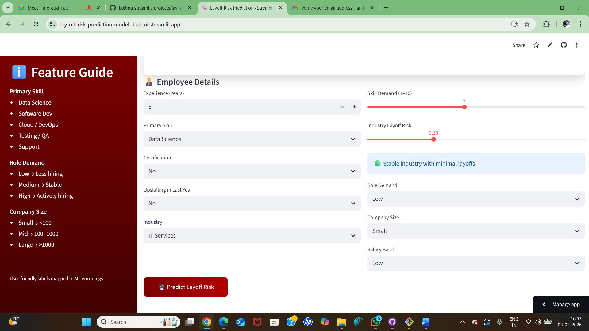

# 🚨 Layoff Risk Prediction App

A user-friendly **Machine Learning–powered Streamlit web application** that predicts an employee’s **layoff risk** based on skills, experience, industry trends, and company factors.

The app converts **business-friendly inputs** into ML-ready features behind the scenes and presents results in an intuitive, non-technical interface.

---

## 🌐 Live Demo

🔗 **Streamlit App:**  
https://lay-off-risk-prediction-model-dark-ui.streamlit.app

---

## 🖼️ Application Preview



---

## 🎯 Key Features

- 📊 **ML-based Layoff Risk Prediction**
- 🧠 Clean mapping from **human-readable labels → ML encodings**
- 🎨 Modern **dark UI** with canvas-style background
- 📘 Built-in **Feature Guide** for easy understanding
- 🎚️ Sliders & dropdowns instead of raw numeric inputs
- ⚡ Fast, lightweight, and deployment-ready

---

## 🧩 Input Features Explained

### Employee Details
- **Experience (Years)** – Total professional experience
- **Primary Skill** – Data Science, Software Dev, Cloud/DevOps, Testing/QA, Support
- **Certification** – Whether the employee holds relevant certifications
- **Upskilling in Last Year** – Recent learning or skill upgrades
- **Industry** – Industry type (e.g., IT Services)

### Market & Company Factors
- **Skill Demand (1–10)** – Market demand for the skill
- **Industry Layoff Risk (0–1)** – Industry-level risk indicator
- **Role Demand** – Low / Medium / High hiring demand
- **Company Size** – Small / Mid / Large
- **Salary Band** – Low / Medium / High

---

## 📘 Feature Guide (Left Panel)

The **Feature Guide** explains:
- Skill categories
- Role demand meaning
- Company size mapping
- User-friendly labels mapped to ML encodings

This makes the app accessible to **non-technical users**.

---

## 🧠 Machine Learning Model

- **Model Type:** Classification model (trained offline)
- **Artifacts Used:**
  - Trained model (`.pkl`)
  - Scaler
  - Feature name mapping
- **Preprocessing:** Handled internally for consistent predictions

---

## 🛠️ Tech Stack

- **Python**
- **Streamlit**
- **scikit-learn**
- **NumPy**
- **Pandas**
- **Pickle**

---

## 📂 Project Structure

```text
├── app.py / new_app_UI.py
├── layoff_model.pkl
├── scaler.pkl
├── feature_names.pkl
├── requirements.txt
├── runtime.txt
├── README.md
└── Screenshot 2026-02-03 165735.png
